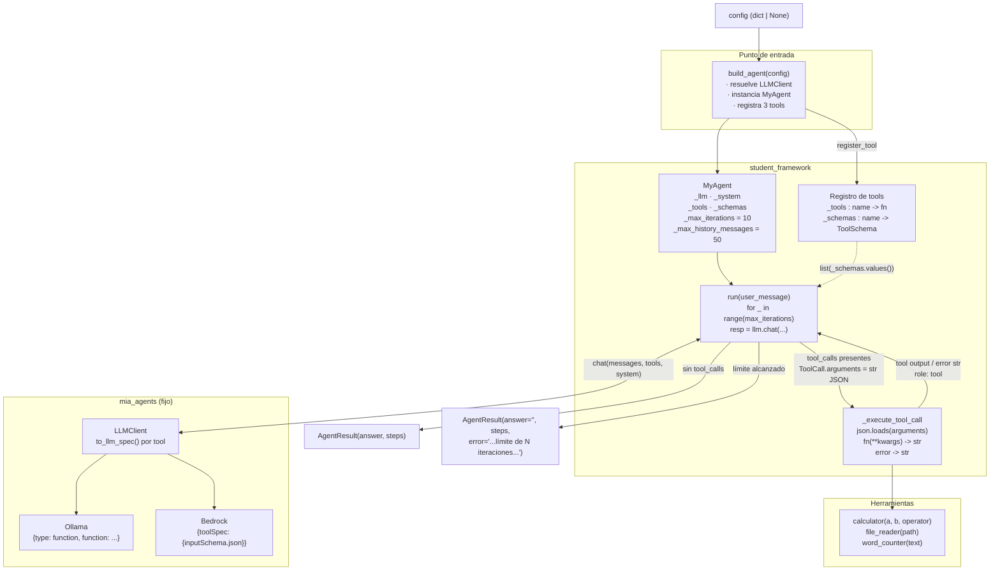

# Informe Milestone 1 — Agente ReAct mínimo

El sistema es un bucle ReAct mínimo implementado en Python 3.11. El punto de entrada es `build_agent(config)` en `student_framework/__init__.py` y la clase principal es `MyAgent` en `student_framework/agent.py`. Soporta dos proveedores de LLM a través del `LLMClient` fijo de la cátedra: AWS Bedrock (`amazon.nova-lite-v1:0`) y Ollama. El código de la cátedra (`mia_agents/`) no se modifica.

## 1. Diagrama de arquitectura



El flujo es lineal: `build_agent` resuelve el `LLMClient` (desde `config` o `LLMClient.from_env()`), instancia `MyAgent` y registra las tres herramientas. En cada vuelta del bucle, `MyAgent.run()` llama a `chat()` con el historial de mensajes, la lista de `ToolSchema` y el system prompt. Si la respuesta trae `tool_calls`, se ejecuta cada una vía `_execute_tool_call` y su salida se reinyecta como mensaje `role: "tool"`. La traducción al formato nativo de cada proveedor la hace el `LLMClient` mediante `to_llm_spec()`; el agente nunca toca esos formatos.

## 2. Diseño de la interfaz de herramientas

Una herramienta es un `Callable[..., str]` acompañado de un `ToolSchema`. El esquema se construye con `ToolSchema.from_callable(fn)`, que deriva nombre, descripción (del docstring) y parámetros a partir de la firma tipada de la función. Los parámetros se anotan con `Annotated[tipo, Field(description=...)]` de Pydantic, lo que aporta el tipo y la descripción de cada argumento. El ejemplo `calculator(a: float, b: float, operator: str)` ilustra el patrón: tipos explícitos, `Field` por parámetro y docstring que describe la operación.

El registro se hace con `register_tool(tool, schema)`, que guarda el callable en `_tools[schema.name]` y el esquema en `_schemas[schema.name]`, ambos indexados por nombre. En `run()`, la lista de esquemas (`list(self._schemas.values())`) se pasa a `chat(tools=...)`. El `LLMClient` fijo invoca `to_llm_spec()` sobre cada `ToolSchema` y lo traduce al formato del proveedor:

- Ollama: `{"type": "function", "function": {name, description, parameters}}`
- Bedrock: `{"toolSpec": {"name", "description", "inputSchema": {"json": ...}}}`

La invocación cierra el contrato en `_execute_tool_call`. El campo `ToolCall.arguments` llega siempre como string JSON; el agente lo parsea con `json.loads` (o `{}` si viene vacío) y llama al callable con `**kwargs`. El resultado siempre es un `str`. Los caminos de fallo están acotados y devuelven un `AgentStep` con `error`: herramienta desconocida (`name not in self._tools`), JSON inválido (`json.JSONDecodeError`) y cualquier excepción del callable (`except Exception`). Las tres herramientas implementadas son `calculator(a, b, operator)` (aritmética binaria `+ - * / %`), `file_reader(path)` (lectura de texto UTF-8) y `word_counter(text)` (conteo con `str.split()`).

## 3. Terminación del bucle y comportamiento en el límite

El bucle es un `for _ in range(self._max_iterations)` con `max_iterations=10` por defecto. Existen dos salidas posibles.

La terminación normal ocurre cuando la respuesta del LLM no contiene `tool_calls`: en ese caso `run()` retorna de inmediato `AgentResult(answer=resp.content or "", steps=steps)`. Es decir, la respuesta final del modelo se interpreta como el texto que devuelve cuando ya no necesita invocar herramientas.

Mientras haya `tool_calls`, cada iteración agrega el mensaje del asistente (con sus `tool_calls`), ejecuta cada llamada, acumula el `AgentStep` correspondiente en `steps` y reinyecta la salida —o el error, si lo hubo— como mensaje `role: "tool"` asociado al `tool_call_id`. Luego vuelve a llamar al LLM en la siguiente vuelta.

Si se agotan las `max_iterations` sin que el modelo produzca una respuesta sin herramientas, el bucle cae fuera del `for` y `run()` retorna:

```
AgentResult(
    answer="",
    steps=steps,
    error=f"Se alcanzó el límite de {self._max_iterations} iteraciones sin respuesta final.",
)
```

En ese caso `answer` queda vacío, `steps` conserva la traza completa de lo ejecutado y `error` señala el corte por límite. El límite es un tope duro de seguridad: no hay terminación anticipada por otro criterio.

## 4. Limitaciones conocidas

1. **Stateless:** `run()` no recuerda turnos anteriores; cada llamada es una conversación nueva.
2. **`max_history_messages` ignorado:** el historial puede crecer sin recorte dentro de un `run` largo.
3. **Tokens no acumulados:** `AgentResult.input_tokens` / `output_tokens` quedan en `None`; no se suman los tokens de cada `LLMResponse`
4. **Sin reintentos:** si `chat()` falla por error de red/API, la excepción se propaga.
5. **`structured_call` no implementado:** es un stub con `NotImplementedError`.
6. **`file_reader` sin sandbox:** lee cualquier path accesible del filesystem, sin restricción de directorio.
7. **Errores de tool como string:** división por cero o archivo inexistente devuelven `"Error: ..."` en vez de fallar; el agente no distingue ese string de un resultado legítimo.
