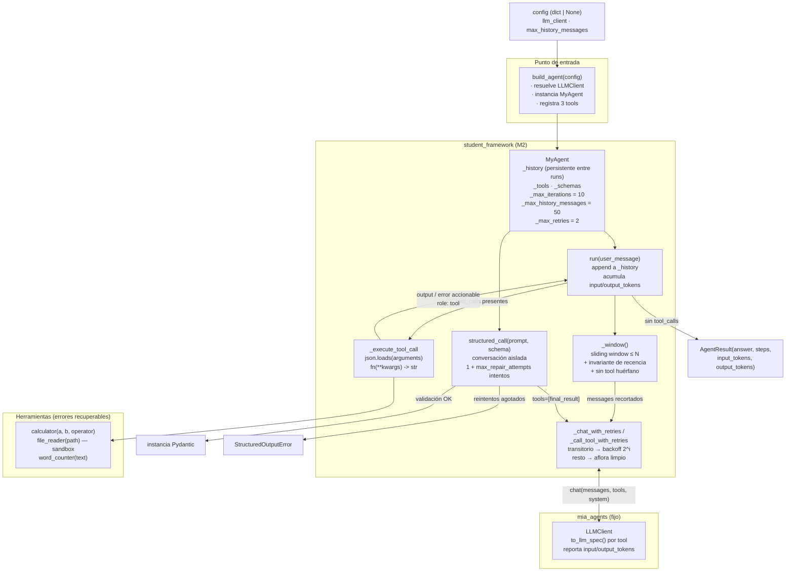

# Informe Milestone 2 — Memoria, prompting y robustez

M2 se construye sobre el agente ReAct de M1 sin cambiar la fachada externa (`build_agent`, `register_tool`, `run`). Toda la lógica nueva —estado conversacional, ventana de contexto, salida estructurada, reintentos y tracking de tokens— vive dentro de `MyAgent` (`student_framework/agent.py`); el cliente LLM de la cátedra (`mia_agents/`) sigue intacto. El agente ahora es estatal: llamadas sucesivas a `run()` sobre la misma instancia continúan la misma conversación, con un historial que se recorta a `max_history_messages` antes de cada llamada al modelo.

## 1. Diagrama de arquitectura

Respecto de M1 hay tres piezas nuevas en el camino de cada llamada: el historial persistente (`_history`), la ventana (`_window()`) que lo recorta antes de enviarlo, y el envoltorio de reintentos (`_chat_with_retries`) entre el agente y el cliente. `structured_call` es un camino paralelo que comparte los reintentos pero usa una conversación propia y una única herramienta sintética (`final_result`).

## 2. Estrategia de memoria

La estrategia es **sliding window por recencia**: `_history` acumula todos los mensajes de la conversación (turnos de usuario, respuestas del asistente con sus `tool_calls` y resultados `role: "tool"`), y antes de cada llamada al LLM `_window()` devuelve solo los últimos `max_history_messages`. El recorte es una *vista* sobre el historial, no una mutación: el historial completo sigue en memoria, de modo que cambiar de estrategia (resumen, retrieval) no requeriría tocar el resto del bucle.

Se eligió conservar los mensajes más recientes y descartar los más viejos porque en un diálogo el contexto inmediato es el que condiciona la respuesta: el último pedido del usuario, la última salida de una herramienta. El tradeoff aceptado es que el agente olvida hechos mencionados muchos turnos atrás una vez que salen de la ventana; una estrategia de summarization los preservaría comprimidos, pero agregaría llamadas extra al LLM y no determinismo en los tests, y quedó deliberadamente fuera del alcance.

La implementación simple (`msgs[-budget:]`) rompía dos casos que aparecieron al escribir los tests, y ambos motivaron invariantes explícitas:

1. **Recencia bajo presión de tool_calls.** Si un único turno genera muchas invocaciones (1 mensaje de usuario + 1 de asistente + k de tools), los últimos N mensajes pueden ser todos de herramientas y el mensaje del usuario —el que el enunciado obliga a preservar— queda fuera. `_window()` lo detecta y fuerza el último mensaje de usuario al inicio de la ventana, completando con lo más reciente. Un caso borde de Python obligó a un guard: con `budget=1`, `window[-(budget-1):]` sería `window[-0:]`, que es la lista completa, no la vacía.
2. **Mensajes `tool` huérfanos.** Tras un recorte, la ventana puede arrancar con un `role: "tool"` cuyo turno de asistente (el que contiene el `tool_call`) quedó descartado. Los proveedores reales rechazan un `toolResult` sin su `toolUse` previo, así que la ventana descarta los mensajes `tool` que queden colgando al inicio. El mock de los tests no lo exige; Bedrock sí.

Con esto, la lista enviada a `chat(...)` nunca supera el presupuesto, el mensaje de usuario más reciente aparece siempre, y una conversación de decenas de turnos con mensajes grandes sigue devolviendo `AgentResult` con `answer` no vacío en cada `run`.

Una decisión de diseño relacionada: `structured_call` **no toca `_history`**. Una extracción estructurada es una operación puntual, no un turno del diálogo; si sus prompts de reparación entraran al historial, contaminarían la conversación del usuario.

## 3. Salida estructurada

`structured_call(prompt, schema, max_repair_attempts=2)` exige la respuesta a través de la herramienta sintética `final_result`, cuyo esquema se arma con `final_result_tool_schema(schema)` (nombre fijo `mia_agents.FINAL_RESULT_TOOL_NAME`). En cada llamada a `chat` se pasa `tools=[final_result]`: el modelo no recibe ninguna otra herramienta, y la descripción de la tool le indica que debe invocarla para terminar.

El presupuesto es `1 + max_repair_attempts` llamadas al LLM. Cada intento puede fallar de tres modos, y cada modo dispara un mensaje de reparación específico:

1. **Texto libre:** la respuesta no contiene un `tool_call` a `final_result`. Se agrega el texto del asistente al hilo y un mensaje de usuario que pide invocar la herramienta.
2. **JSON malformado:** `ToolCall.arguments` no parsea (`json.JSONDecodeError`).
3. **Validación fallida:** el JSON parsea pero `schema.model_validate(...)` levanta `ValidationError` (tipo incorrecto, campo faltante).

En los modos 2 y 3 el turno del asistente (con su `tool_call`) se registra en el hilo, el error concreto se reinyecta como mensaje `role: "tool"` y se agrega el pedido de reparación. El mensaje de reparación incluye siempre dos cosas: el error textual y el JSON Schema completo del modelo (`schema.model_json_schema()`), para que el modelo sepa exactamente qué formato se espera en el reintento.

El éxito devuelve la instancia Pydantic validada. Si se agotan los intentos, `structured_call` levanta `StructuredOutputError` con el conteo de intentos y el último error; nunca devuelve `None` ni una instancia parcial. Con `max_repair_attempts=2` eso significa exactamente 3 llamadas al LLM antes de fallar.

## 4. Resiliencia y tracking de tokens

Las llamadas al cliente LLM y a las herramientas pasan por el mismo envoltorio de reintentos (`_chat_with_retries` / `_call_tool_with_retries`). Un fallo se considera **transitorio** si es `TimeoutError`/`ConnectionError` o si el texto de la excepción contiene marcadores típicos de proveedor (`timeout`, `throttl`, `rate`, `429`, `500`, `502`, `503`, `overload`, `unavailable`, ...). Los transitorios se reintentan hasta `max_retries` veces adicionales con backoff exponencial (`retry_base_delay · 2^intento`); cualquier otro error —bugs, credenciales inválidas, argumentos incorrectos— aflora limpio en el primer intento, porque reintentarlo solo demoraría el mismo fallo. La clasificación por marcadores evita acoplar el agente a las clases de excepción concretas de boto3 u ollama.

`run()` acumula además los tokens reportados: si ninguna `LLMResponse` de la ejecución informó tokens, `AgentResult.input_tokens` y `output_tokens` quedan en `None`; si alguna informó, se suma lo reportado tratando el `None` de una respuesta individual como 0. El conteo acompaña a los tres retornos posibles de `run` (respuesta final, y corte por `max_iterations`).

## 5. Errores recuperables en herramientas

El criterio general: un error es *recuperable* cuando el LLM puede corregir los argumentos y reintentar. En ese caso la herramienta no lanza ni devuelve un mensaje genérico: devuelve un string accionable con el formato "qué falló + qué valor llegó + cómo corregir", que el bucle reinyecta como mensaje `role: "tool"`. El modelo lee la observación y corrige en la siguiente vuelta.

**Calculadora** (`calculator`):

- Operando no numérico: nombra el parámetro, el valor y el tipo recibidos — `Error recuperable: el parámetro 'a' debe ser numérico, pero se recibió 'tres' (tipo str). Reintentá pasando un número, por ejemplo 3 o 2.5.` (`bool` se rechaza explícitamente: en Python es subclase de `int`).
- Operador no soportado: lista el conjunto permitido — `Operadores permitidos: +, -, *, /, %`.
- División o módulo por cero: explica la restricción y qué parámetro la viola — `el divisor 'b' vale 0 y la división por cero no está definida`.

**Lector de archivos** (`file_reader`), ahora acotado al sandbox `student_framework/sandbox/`:

- Ruta vacía, absoluta o con `..`: indica la regla violada y muestra cómo debe verse una ruta válida (`'notas.txt'`, `'datos/info.txt'`). Como defensa extra, la ruta resuelta (`resolve()`, que sigue symlinks) debe seguir bajo la raíz del sandbox.
- Archivo inexistente con directorio válido: **lista los archivos disponibles** en ese directorio, para que el modelo elija el nombre correcto en el reintento.
- La ruta es un directorio: lo indica y lista su contenido.

La raíz del sandbox es una constante de módulo (`SANDBOX_ROOT`) y no un parámetro de la función: si fuera parámetro aparecería en el esquema y el propio LLM podría elegir otra raíz.

**Ejemplo de recuperación — calculadora.** El modelo pide `calculator(a=10, b=5, operator="^")`; la herramienta responde con el error que lista los operadores permitidos; en la siguiente llamada el modelo reintenta con `operator="*"` y obtiene `50`. El `AgentResult` termina con dos `AgentSteps` (el primero con `error` no nulo, el segundo exitoso) y la respuesta final correcta.

**Ejemplo de recuperación — lector de archivos.** El modelo pide `file_reader(path="reporte.txt")` sobre un sandbox que solo contiene `informe.txt`; el error devuelto lista `informe.txt` como disponible; el modelo reintenta con ese nombre y obtiene el contenido. Ambos flujos están verificados end-to-end en los tests propios (`test_recuperacion_end_to_end_*` en `tests/test_my_agent_m2.py`), con un `MockLLMClient` que simula exactamente esa secuencia de corrección.

## 6. Modos de fallo: dentro y fuera del alcance

**Cubiertos deliberadamente:**

- Timeouts, errores de red, throttling y 5xx del LLM o de una herramienta (reintento con backoff; agotados los reintentos, el fallo se propaga limpio).
- Salidas malformadas en `structured_call`: texto libre, JSON roto, validación fallida (reparación con presupuesto acotado; `StructuredOutputError` al agotarlo).
- Historial que excede el presupuesto de mensajes, incluso con turnos de muchos `tool_calls` (ventana + invariantes de recencia y de tool huérfano).
- Herramienta alucinada, argumentos JSON inválidos y excepciones internas de tools (quedan como `AgentStep.error`, el bucle sigue).
- Argumentos corregibles en calculadora y lector (mensajes accionables + recuperación demostrada).

**Fuera del alcance, deliberadamente:**

1. **Resumen o compresión del contexto:** solo sliding window. Un summarizer preservaría contexto viejo pero agrega llamadas LLM, latencia y no determinismo en los tests.
2. **Persistencia del historial entre procesos:** la memoria vive en la instancia; reiniciar el proceso la pierde.
3. **Alternancia estricta user/assistant tras el recorte:** la ventana puede arrancar en un mensaje de asistente; Bedrock lo tolera, pero proveedores más estrictos podrían requerir normalización adicional.
4. **Presupuesto por tokens:** el límite es por cantidad de mensajes, no por tamaño; un mensaje individual gigante puede exceder el contexto real del modelo aunque la ventana respete N.
5. **Retries con jitter o circuit breaker:** el backoff exponencial simple alcanza para el alcance del TP; bajo contención real de rate limits, el jitter evitaría reintentos sincronizados.
6. **Errores de tool señalizados como string:** un `"Error recuperable: ..."` es indistinguible de un contenido legítimo que empiece igual; un canal de error tipado (excepciones controladas o un campo estructurado) sería más robusto.
