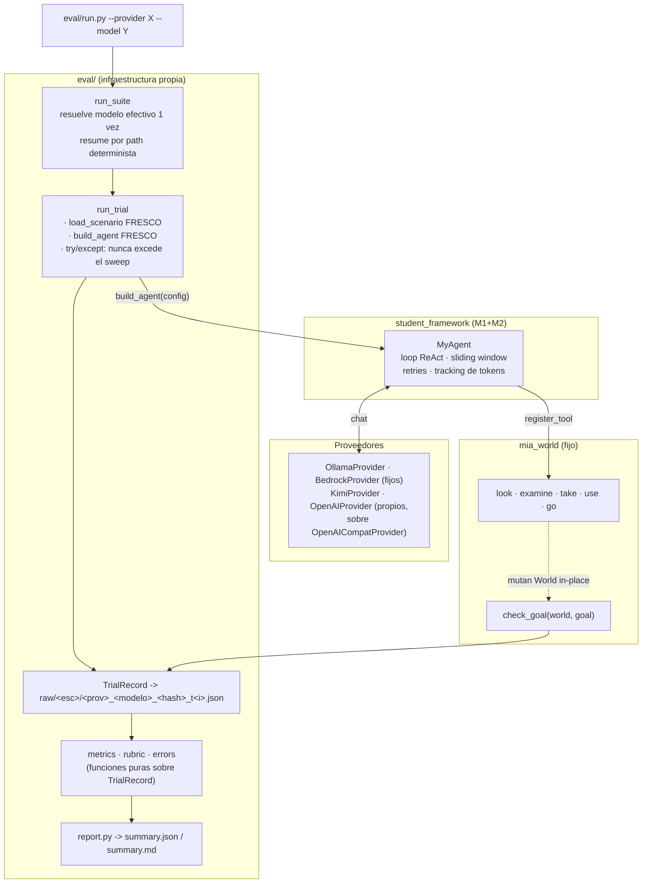

# Informe Milestone 3 — Evaluación sobre el mundo simulado

M3 no agrega capacidades al agente: usa el framework de M1+M2 para resolver los ocho escenarios de sala de escape de `mia_world/` y mide qué tan lejos llega. Toda la infraestructura de evaluación vive en `eval/`, es reproducible con `python eval/run.py` y no requiere ningún paso manual más allá de tener configurado un proveedor LLM.

Los números de este informe provienen de **240 trials** ejecutados contra tres modelos de capacidad creciente: `qwen2.5` (7.6B, local vía Ollama, 120 trials), `amazon.nova-lite-v1:0` (AWS Bedrock, 60 trials) y `gpt-4o-mini` (API de OpenAI, 60 trials). Un cuarto proveedor, Kimi (Moonshot), quedó implementado y testeado pero sin corrida de evaluación (ver §5).

## 1. Aproximación

### 1.1 Integración con el mundo

La integración replica el patrón del runner fijo provisto en el tp (`mia_world/cli.py`): se construye el agente con `build_agent(config)`, se registran las herramientas del mundo con `for fn, schema in make_world_tools(world): agent.register_tool(fn, schema)`, se ejecuta `agent.run(scenario.user_message)` y se comprueba el objetivo con `check_goal(world, scenario.goal)` sobre el mismo `World` de las herramientas.

El agente no necesitó ninguna adaptación al dominio: las cinco herramientas de `mia_world` (`look`, `examine`, `take`, `use`, y `go` en los escenarios multi-sala) llegan como pares `(callable, ToolSchema)` y entran por la misma `register_tool` que ya usaban las tres herramientas de M1.

### 1.2 En qué se puso el foco

Tres cosas, todas fuera del agente:

**Un system prompt de dominio** (`eval/prompts.py`). El default de `MyAgent` ("Eres un asistente útil.") no dice nada sobre explorar una sala. La variante `escape_room` indica observar con `look` antes de actuar, llevar cuenta del mapa al navegar, planificar el orden cuando la meta lo exige, y no repetir una acción que ya falló. Se pasa por `config`, no se hardcodea: el default de M1/M2 queda como estaba.

**Un `build_agent` que reenvía más parámetros.** Antes solo propagaba `max_history_messages`; ahora también `max_iterations`, `system_prompt`, `max_retries` y `retry_base_delay`. Sin eso no se pueden variar esos parámetros entre arms de un experimento sin editar código. Las tres líneas marcadas `#NO CAMBIAR` quedaron intactas y el comportamiento por defecto no cambia.

**Dos proveedores propios.** `mia_agents/llm_client.py` es fijo y solo conoce Bedrock y Ollama. Para comparar otros modelos que elegimos luego de hablar con Franco, fue necesario que se implementaron `KimiProvider` y `OpenAIProvider` en `student_framework/`, satisfaciendo el protocolo `LLMClient`. Ambos hablan el mismo dialecto (`POST /chat/completions` estilo OpenAI), así que la traducción común —mensajes, herramientas, tool calls, tokens— vive en una base compartida, `OpenAICompatProvider`, y cada proveedor concreto se reduce a declarar sus constantes y sus dos o tres diferencias reales.

### 1.3 Dos invariantes del harness

`run_trial` recarga el escenario y reconstruye el agente en **cada** trial. Por qué lo hicimos así? `Scenario.initial_world` es mutable y las herramientas lo modifican, así que reusar un `Scenario` haría que el segundo trial arrancara con la puerta ya abierta; y el `_history` de M2 persiste entre llamadas a `run()` sobre la misma instancia, así que reusar el agente contaminaría los trials entre sí. Ambas cosas están fijadas por tests (`test_run_trial_fresh_world_per_call`).

## 2. Métricas

### 2.1 Cuantitativas

**Success rate.** La fracción de trials donde `check_goal` devuelve verdadero. Se eligió como métrica principal porque `check_goal` inspecciona el **estado del mundo**, no el texto del agente: para contar como resuelto tiene que haberse abierto la puerta de verdad, no basta con que el modelo afirme haberla abierto.

Se reporta en dos agregaciones. La **micro** promedia sobre todos los trials; la **macro** promedia primero por escenario y después entre escenarios. Con un dataset donde un escenario puede tener 24 trials y otro 3. Se publican las dos porque cuentan cosas distintas.

**Eficiencia.** `optimal_calls / tool_call_count`, definida solo sobre los trials exitosos. El enunciado da la longitud óptima de cada escenario, así que se puede medir no solo si el agente resolvió sino cuánto se desvió del camino mínimo. Queda en (0, 1], donde 1 es óptimo. Se eligió esa orientación —y no `real/óptimo`— para que el sentido de cuánto mayor  mejor valga igual que en las otras métricas y las tres se puedan leer en la misma dirección. Sobre los trials fallidos es indefinida y se excluye del promedio en vez de contarse como cero: un fallo ya está registrado en el success rate, y contarlo otra vez como eficiencia cero mezclaría dos preguntas distintas.

### 2.2 Cualitativa: rúbrica determinista

Se optó por una rúbrica heurística en vez de LLM-as-judge. La razón es que cada criterio se computa por comparación exacta de cadenas que el propio framework produce de manera determinista, así que la evaluación es reproducible, gratuita y explicable línea por línea; un juez LLM habría agregado costo, latencia y no determinismo al pipeline de medición, además de una caja negra difícil de defender.

| Criterio | Qué mide | Cómo se computa |
|---|---|---|
| **R1** look-first | ¿Observó antes de actuar a ciegas? | El primer `AgentStep` es `look` |
| **R2** no-loop | ¿Aprendió del error o insistió igual? | Ninguna `(tool, args)` se repite en ≥2 steps fallidos |
| **R3** sin alucinación | ¿Inventó herramientas o argumentos? | Ningún `step.error` empieza con `"Herramienta desconocida:"` o `"Argumentos JSON inválidos:"` |
| **R4** orden de secuencia | En metas ordenadas, ¿respetó el orden? | `goal_reason` no menciona `"orden"` |
| **R5** eficiencia | ¿Fue razonablemente directo? | Reusa la métrica de eficiencia |

Cada criterio devuelve un valor en [0,1] o `None` cuando no aplica —R4 solo aplica a metas de tipo `sequence`, R2 solo si hubo algún step fallido—, y los `None` se excluyen del promedio en lugar de contar como cero. Además del score compuesto se publica el pass-rate de cada criterio por separado, con su `n` aplicable.

Un detalle de implementación que importa para la validez de R2: las herramientas de `mia_world` **nunca lanzan excepción** —devuelven un string `"Error: ..."` como salida normal—, así que `AgentStep.error` solo se activa ante fallos del marco, no ante un error del mundo. Cualquier regla que quiera detectar que este paso falló, tiene que mirar los dos campos. `eval/trace_utils.py` centraliza ese criterio.

## 3. Resultados

### 3.1 Tabla principal (configuración por defecto)

Ocho escenarios × 3 trials, con `max_iterations` en su valor por defecto de 10.

| Escenario | Dificultad | Óptimo | qwen2.5 | nova-lite | gpt-4o-mini |
|---|---|---:|---:|---:|---:|
| study-with-key | easy | 3 | 3/3 | 3/3 | 3/3 |
| color-locks | medium | 11 | 0/3 | 0/3 | 0/3 |
| apartment-keys | medium | 7 | 0/3 | 0/3 | **3/3** |
| library-search | hard | 7 | 0/3 | **1/3** | 0/3 |
| office-sequence | hard | 13 | 0/3 | 0/3 | 0/3 |
| extreme-archive | extreme | 4 | 0/3 | 0/3 | 0/3 |
| vault-combination | extreme | 21 | 0/3 | 0/3 | 0/3 |
| backtracking-vault | extreme | 18 | 0/3 | 0/3 | 0/3 |
| **Total (micro)** | | | **12 %** | **17 %** | **25 %** |

Los tres modelos resuelven `study-with-key` (el único cuyo óptimo, 3 acciones, cabe holgadamente en el presupuesto) y ninguno resuelve los seis escenarios cuyo óptimo supera las 10 acciones. Las únicas diferencias aparecen en los dos escenarios intermedios, y no se ordenan por capacidad: gpt-4o-mini resuelve `apartment-keys` (7 acciones) las tres veces pero nunca `library-search`; nova-lite hace exactamente lo contrario, una de tres. Con `n=3` esa asimetría no alcanza para afirmar que un modelo sea mejor que otro en un escenario puntual.

La lectura inmediata es que los tres modelos resuelven lo trivial y fracasan en todo lo demás. Pero el análisis de errores muestra que ese diagnóstico es engañoso.

### 3.2 Tabla con presupuesto suficiente (`max_iterations = 21`)

La tabla anterior mide el agente con un presupuesto que, para la mitad de los escenarios, es insuficiente por construcción. Para separar "el agente no sabe resolverlo" de "el agente no llega a intentarlo", se repitió la corrida completa —8 escenarios × 3 trials × 3 modelos, 72 trials— con `max_iterations = 21`.

El valor no es arbitrario: 21 es la longitud óptima del escenario más largo (`vault-combination`), o sea **el mínimo presupuesto con el que los ocho escenarios son alcanzables en principio**. Si con 21 el agente sigue fallando, la causa ya no puede ser el techo de iteraciones.

| Escenario | Óptimo | qwen2.5 | nova-lite | gpt-4o-mini |
|---|---:|---:|---:|---:|
| study-with-key | 3 | 3/3 | 3/3 | 3/3 |
| extreme-archive | 4 | 0/3 | 0/3 | 0/3 |
| apartment-keys | 7 | 0/3 | 3/3 | 3/3 |
| library-search | 7 | 0/3 | 2/3 | 2/3 |
| color-locks | 11 | **3/3** | 0/3 | 2/3 |
| office-sequence | 13 | 0/3 | 3/3 | 3/3 |
| backtracking-vault | 18 | 0/3 | 0/3 | 0/3 |
| vault-combination | 21 | 0/3 | 0/3 | 0/3 |
| **Total** | | **25 %** | **46 %** | **54 %** |

Comparado con el presupuesto por defecto, el éxito **más que se duplica en los tres modelos**:

| Modelo | `max_iterations=10` | `max_iterations=21` | Factor |
|---|---:|---:|---:|
| qwen2.5 | 12 % | 25 % | ×2,0 |
| nova-lite | 17 % | 46 % | ×2,7 |
| gpt-4o-mini | 25 % | 54 % | ×2,2 |

Los dos escenarios que más se mueven son `office-sequence` (13 acciones, meta compuesta y ordenada) y `apartment-keys` (7, multi-sala): ambos pasan de 0/3 a 3/3 en los dos modelos de API. Es decir, el agente **siempre supo resolverlos** —incluidos la navegación entre salas y el orden obligatorio del goal `sequence`—; lo único que le faltaba era presupuesto para terminar lo que ya había empezado bien.

**Los tres escenarios que resisten, y por qué son tres casos distintos:**

`vault-combination` (óptimo 21) falla en 0/9 trials. Con el presupuesto igualado al óptimo exacto, resolverlo exigiría una ejecución perfecta: cero exploración, cero errores, cero acciones desperdiciadas. Ningún agente real opera así — hace falta un `look` para orientarse, algún `examine` de tanteo. El presupuesto es suficiente en teoría e insuficiente en la práctica.

`backtracking-vault` (óptimo 18) falla en 0/9 con solo 3 llamadas de margen. Además penaliza doblemente el tanteo: exige volver sobre los pasos ya dados —el cofre de la primera sala solo abre con la llave de la última—, así que una exploración equivocada cuesta el doble en desplazamientos.

`extreme-archive` es el caso interesante, porque **falla por una razón completamente distinta**. Su óptimo es 4, cabe holgadamente en cualquier presupuesto, y aun así ningún modelo lo resuelve nunca. La traza explica por qué: el escenario esconde una llave en 1 de 20 expedientes y el agente no tiene forma de saber en cuál, así que los examina uno por uno. El costo real no es 4 acciones sino ~22, y cada `examine` devuelve un documento burocrático extenso que se acumula en el historial. Los tokens de entrada de un solo trial llegan a **165 000 en nova-lite** y 121 000 en gpt-4o-mini: el contexto crece cuadráticamente porque cada vuelta reenvía todo lo leído hasta ahí. qwen2.5 ni siquiera llega a ese punto —abandona tras 5 a 9 acciones y responde con texto—, lo que en la taxonomía cae como `unclassified`.

Es exactamente el modo de fallo que el enunciado anticipaba para este escenario, y confirma que **el óptimo publicado supone un oráculo**: mide el camino de quien ya sabe la respuesta, no el costo de buscarla. Para un agente sin esa información, la métrica de eficiencia contra ese óptimo es engañosa en escenarios de búsqueda.

**Qué cambia en los modos de fallo.** Con 21 iteraciones el cuadro se reordena:

| Modelo | Fallos | Distribución |
|---|---:|---|
| qwen2.5 | 18 | `unrecovered_tool_error` 6, `max_iterations_exhausted` 6, `unclassified` 6 |
| nova-lite | 13 | `max_iterations_exhausted` 13 (100 %) |
| gpt-4o-mini | 11 | `max_iterations_exhausted` 11 (100 %) |

En qwen2.5, `max_iterations_exhausted` deja de ser dominante (de 83 % a un tercio) y emergen los fallos de capacidad: acciones erróneas sin recuperar y abandonos prematuros. Es el segundo cuello de botella apareciendo detrás del primero. En los dos modelos de API el 100 % de los fallos sigue siendo por presupuesto, pero ahora concentrados en los tres escenarios que genuinamente necesitan más de 21 acciones útiles.

**Una inversión llamativa.** En `color-locks` (11 acciones, cadena de cofres con llaves de colores) qwen2.5 obtiene 3/3 mientras nova-lite obtiene 0/3, invirtiendo el orden general entre los dos modelos. El escenario es una cadena estrictamente lineal sin navegación: cada llave abre el cofre siguiente. Una hipótesis razonable es que premia la ejecución metódica por encima de la planificación, y que el modelo local —que nunca agrupa acciones ni improvisa atajos— encaja mejor en ese patrón. Con `n=3` es una observación, no una conclusión.

### 3.3 Análisis de errores

Las categorías se derivan por reglas en orden de prioridad, la primera que coincide gana. Las cuatro primeras son comparación exacta contra mensajes que produce el propio framework; solo `context_window_too_small` es una heurística, declarada como tal.

| Categoría | qwen2.5 (113 fallos) | nova-lite (52 fallos) | gpt-4o-mini (44 fallos) |
|---|---:|---:|---:|
| `max_iterations_exhausted` | 83 % | **100 %** | **100 %** |
| `unclassified` | 12 % | — | — |
| `unrecovered_tool_error` | 5 % | — | — |
| `hallucinated_tool_or_args` | 0 % | 0 % | 0 % |
| `sequence_order_violated` | 0 % | 0 % | 0 % |

El resultado dominante es que **el agente casi nunca falla por no saber qué hacer: falla por quedarse sin presupuesto de iteraciones**. En los dos modelos de API, el 100 % de los fallos son por agotar `max_iterations`. Cero alucinaciones de herramienta y cero violaciones de orden en los tres modelos, sobre 240 trials.

Esto tiene una explicación estructural. `max_iterations` cuenta **llamadas al LLM**, no invocaciones de herramienta, y en la práctica los modelos piden casi siempre una herramienta por turno. Midiendo el cociente entre acciones ejecutadas y llamadas consumidas en los trials que agotaron el presupuesto: qwen2.5 da exactamente **1,00** (nunca agrupa, en 30 trials), nova-lite **1,07** y gpt-4o-mini **1,14**. Los dos modelos de API sí agrupan a veces —en un tercio y la mitad de sus trials respectivamente, con picos de 2,5 a 2,8 acciones por llamada—, pero el promedio queda tan cerca de 1 que el presupuesto de iteraciones sigue siendo, a efectos prácticos, un presupuesto de acciones. Con un tope de 10 llamadas, cualquier escenario cuya solución óptima supere las 10 acciones es **inalcanzable por construcción**, sin importar lo bien que razone el modelo. Cuatro de los ocho están en esa situación: `color-locks` (11), `office-sequence` (13), `backtracking-vault` (18) y `vault-combination` (21). Los otros cuatro caben en el presupuesto, pero sin margen: el óptimo no deja lugar para explorar, equivocarse ni corregir, y en la práctica el agente necesita varias acciones de más. El experimento B lo confirma midiéndolo, y §3.2 lo verifica levantando el techo hasta que los ocho quepan.

### 3.4 Rúbrica

| Criterio | qwen2.5 | nova-lite | gpt-4o-mini |
|---|---:|---:|---:|
| R1 look-first | 100 % (n=120) | 100 % (n=60) | 100 % (n=60) |
| R2 no-loop | 74 % (n=103) | 75 % (n=51) | 94 % (n=31) |
| R3 sin alucinación | 100 % (n=120) | 100 % (n=60) | 100 % (n=60) |
| R4 orden de secuencia | 100 % (n=24) | 100 % (n=12) | 100 % (n=12) |
| R5 eficiencia | 69 % (n=7) | ~70 % (n=8) | 64 % (n=16) |
| **Score compuesto** | **0,92** | **0,92** | **0,96** |

La rúbrica captura algo que el success rate no ve: **el comportamiento del agente es disciplinado incluso cuando fracasa**. Siempre observa antes de actuar, nunca inventa una herramienta y nunca rompe el orden de una meta compuesta, en ninguno de los 240 trials.

La única diferencia real entre modelos está en R2. qwen2.5 y nova-lite repiten una acción ya fallida en aproximadamente uno de cada cuatro trials con algún fallo (74 % y 75 % de aprobación); gpt-4o-mini, en uno de cada dieciséis (94 %). Ese es el patrón de "oscilación" visible en las trazas —por ejemplo, alternar `go norte` / `go sur` entre dos salas sin avanzar— y es la diferencia cualitativa más nítida del conjunto. Es interesante que nova-lite quede junto a qwen2.5 en este criterio pese a ser un modelo de API: la disciplina para no repetirse no acompaña necesariamente al tamaño.

R5 tiene un `n` chico en los tres casos porque solo aplica a trials exitosos; sus valores hay que leerlos como indicativos, no como estimaciones firmes.

### 3.5 Costo

| | qwen2.5 (local) | nova-lite (API) | gpt-4o-mini (API) |
|---|---:|---:|---:|
| Tokens de entrada / trial | 17 243 | 34 911 | 17 220 |
| Tokens de salida / trial | 483 | 849 | 243 |
| Tiempo de pared / trial | 21,9 s | 11,9 s | 12,5 s |

Los dos modelos con éxito comparable en el baseline consumen entradas casi idénticas (17,2 K) porque el volumen lo fija el escenario y la ventana de contexto, no el modelo. La excepción es nova-lite, con el doble de tokens de entrada: no porque reciba prompts más largos, sino porque completa más iteraciones antes de agotarse —su promedio incluye los arms de 25 iteraciones del experimento B, donde llega hasta el final— y cada iteración reenvía el historial acumulado. Es un recordatorio de que el consumo de entrada en un bucle ReAct crece cuadráticamente con la cantidad de vueltas, no linealmente.

gpt-4o-mini es el más económico en salida (243 tokens/trial, la mitad que qwen2.5 y un tercio que nova-lite) y resuelve el doble de escenarios que el modelo local.

## 4. Experimentos

### 4.1 Experimento B — presupuesto de iteraciones

**Hipótesis.** El valor por defecto de `max_iterations` (10) es insuficiente en los escenarios de solución larga, porque el modelo no agrupa varias `tool_calls` por respuesta. Predice que subir el tope mejora el éxito y que la categoría `max_iterations_exhausted` domina en el arm de control.

**Diseño.** Cuatro escenarios largos (`color-locks` 11, `office-sequence` 13, `backtracking-vault` 18, `vault-combination` 21) × tres arms (10, 15, 25) × 3 trials, por cada uno de los tres modelos. En total, 108 trials.

| `max_iterations` | qwen2.5 | nova-lite | gpt-4o-mini |
|---:|---:|---:|---:|
| 10 (default) | 0/12 (0 %) | 0/12 (0 %) | 0/12 (0 %) |
| 15 | 0/12 (0 %) | 0/12 (0 %) | 1/12 (8 %) |
| 25 | 1/12 (8 %) | 4/12 (33 %) | **9/12 (75 %)** |

Y la categoría de fallo dominante, en paralelo:

| `max_iterations` | `max_iterations_exhausted` (qwen2.5 / nova-lite / gpt-4o-mini) |
|---:|---|
| 10 | 11 / 12 / 12 (de 12) |
| 15 | 9 / 12 / 11 |
| 25 | 3 / 8 / 3 |

**Conclusión: H1 confirmada, y con un efecto mucho mayor al esperado.**

El dato más contundente está en la primera fila: **los tres modelos obtienen exactamente 0 % con el valor por defecto**, desde un 7B local hasta dos modelos de API. Eso descarta que sea una limitación de capacidad de un modelo particular y lo ubica donde corresponde: es una restricción **estructural del framework**. Con 10 llamadas al LLM y un modelo que pide una herramienta por turno, un escenario de 21 acciones no se puede resolver ni en principio.

Al levantar el techo a 25, los tres mejoran y la mejora escala con la capacidad del modelo: qwen2.5 8 %, nova-lite 33 %, gpt-4o-mini 75 %. Con gpt-4o-mini, tres de los cuatro escenarios pasan a resolverse de forma consistente (`color-locks` 3/3, `office-sequence` 3/3, `backtracking-vault` 3/3) y solo `vault-combination` —el más largo, con cerradura multi-ítem y puertas con llave— resiste. El mismo agente, los mismos escenarios: lo único que cambió fue un número de configuración.

La lectura conjunta es que el presupuesto de iteraciones y la capacidad del modelo son **dos cuellos de botella en serie**. Con el tope en 10, el primero está tan apretado que enmascara por completo al segundo y los tres modelos se ven igual de malos. Recién al aflojarlo emerge la diferencia real entre ellos. En qwen2.5 el segundo cuello aparece casi de inmediato, visible en el desplazamiento de las categorías de error desde `max_iterations_exhausted` hacia `unclassified` y `unrecovered_tool_error`.

La conclusión de diseño es que **el valor por defecto de M1 estaba mal calibrado para tareas agénticas de horizonte largo**. Diez llamadas al LLM alcanzan para una conversación con herramientas, no para una sala de escape de veinte acciones.

### 4.2 Experimento A — presupuesto de memoria

**Hipótesis.** Una ventana de historial chica degrada el desempeño en escenarios multi-sala, porque el agente olvida el mapa que recorrió o qué objetos ya tomó. Predice una caída de éxito con ventanas pequeñas, concentrada en la categoría `context_window_too_small`.

**Diseño.** Cuatro escenarios multi-sala × tres arms de `max_history_messages` (8, 16, 50) × 3 trials, con qwen2.5.

| `max_history_messages` | Éxito | Categoría dominante |
|---:|---:|---|
| 8 | 0/12 (0 %) | `max_iterations_exhausted` (11) |
| 16 | 0/12 (0 %) | `max_iterations_exhausted` (10) |
| 50 (default) | 0/12 (0 %) | `max_iterations_exhausted` (11) |

**Conclusión: H1 rechazada, pero por un motivo que el propio experimento revela.** No hay diferencia entre los tres arms: los tres dan 0 % y la misma distribución de errores. La explicación no es que la memoria no importe, sino que **este experimento no llega a medirla**: con `max_iterations=10`, los trials mueren por falta de iteraciones antes de que el tamaño de la ventana alcance a influir. Los dos límites interactúan, y el de iteraciones domina.

Es un resultado negativo informativo: dice que en este dominio, con esta configuración, **el presupuesto de iteraciones es el factor limitante y la ventana de contexto es de segundo orden**. Una versión correcta de este experimento tendría que fijar `max_iterations` en 25 —el arm donde el agente sí resuelve— y recién ahí variar la ventana. Se corrió una variante así en una iteración anterior del harness, con resultados sin tendencia clara (8 %, 0 %, 8 %), pero esos datos quedaron invalidados por el problema de atribución de modelo descrito en §5 y no se reportan como evidencia.

### 4.3 Experimento C — herramientas de M1 como no-op

**Hipótesis.** `build_agent` registra siempre `calculator`, `file_reader` y `word_counter`, que en este dominio son ruido puro. Su presencia en el prompt podría aumentar las alucinaciones de herramienta o degradar el éxito.

**Diseño.** Los ocho escenarios × 3 trials, con y sin las tres herramientas reemplazadas por no-ops que devuelven un mensaje fijo. Se aprovecha que `register_tool` indexa por `schema.name`: basta re-registrar sobre los mismos schemas después de `build_agent`, sin tocar `student_framework`.

| Herramientas M1 | Éxito | `hallucinated_tool_or_args` |
|---|---:|---:|
| reales | 3/24 (12 %) | 0 |
| no-op | 3/24 (12 %) | 0 |

**Conclusión: H1 rechazada, sin ambigüedad.** El éxito es idéntico y no hubo una sola alucinación de herramienta en ninguno de los dos arms. El modelo simplemente ignora las herramientas irrelevantes: nunca las invoca. Es un resultado tranquilizador sobre la interfaz de herramientas —exponer capacidades que no aplican no confunde al agente— y coherente con el 100 % de R3 en toda la evaluación.

## 5. Limitaciones y qué construiríamos a continuación

### 5.1 Un problema de reproducibilidad que hubo que arreglar en el camino

La primera versión del harness **no registraba con qué modelo se había corrido cada trial**, y el hash que nombra los archivos de resultados tampoco incluía el modelo. La consecuencia fue concreta: dos corridas del mismo escenario con modelos distintos escribían en el mismo archivo y la segunda pisaba a la primera. Se acumularon 143 trials imposibles de atribuir, con resultados que cambiaban entre sesiones sin explicación aparente.

El arreglo tiene tres partes: `TrialRecord` ganó un campo `model`; el modelo entra en el hash de configuración y en el nombre del archivo (`ollama_qwen2-5_e6a6ea16_t0.json`); y `eval/providers.py` fija un modelo por defecto explícito por proveedor, para que una corrida nunca dependa en silencio de lo que haya en el `.env`. Hay tests que fijan las dos propiedades. Los 143 trials viejos se archivaron en `eval/results/raw_legacy/` en lugar de borrarse, y ninguno de sus números se usa en este informe.

La lección es que en una infraestructura de evaluación, **la procedencia de un resultado es parte del resultado**. Un número sin saber qué lo produjo no es un dato.

### 5.2 Un bug de M2 que solo apareció contra un proveedor real

Durante la corrida de OpenAI, dos trials de `vault-combination` fallaron con `400 Bad Request`. La causa resultó ser un defecto en la ventana deslizante de M2: al anteponer el último mensaje del usuario para respetar la invariante de recencia, la cola podía empezar con un mensaje `role="tool"` cuyo turno `assistant` había quedado recortado. La guarda existente solo miraba la primera posición, que tras la reconstrucción es el mensaje del usuario, así que los huérfanos en las posiciones siguientes sobrevivían.

`MockLLMClient` acepta esos historiales sin objetar, así que **ninguno de los tests de M2 lo detectaba**; OpenAI y Bedrock los rechazan. El arreglo verifica por `tool_call_id` en lugar de por posición, y quedó cubierto por dos tests de regresión, uno de ellos barriendo varios presupuestos de ventana. Es el hallazgo metodológicamente más interesante de M3: **evaluar de punta a punta contra un proveedor estricto encontró un bug que la suite de tests con mocks no podía encontrar.**

### 5.3 Limitaciones conocidas

1. **`n` chico.** Tres trials por celda alcanzan para ver un efecto del tamaño del experimento B (0 % → 75 %), pero no para estimar diferencias finas ni calcular intervalos de confianza.
2. **Kimi sin corrida de evaluación.** El proveedor está implementado y cubierto por 15 tests, y un trial de humo confirma que funciona end-to-end, pero la cuenta disponible tiene un tope de 3 requests por minuto: el sweep planificado habría tardado más de cinco horas y se descartó. La comparación queda con tres modelos en vez de cuatro.
3. **Temperatura no comparable con Kimi.** Toda la línea vigente de Moonshot rechaza cualquier temperatura distinta de 1, así que ese proveedor omite el parámetro mientras los otros dos corren a 0,2. Cualquier comparación futura que lo incluya arrastra ese confound.
4. **El experimento A no midió lo que se propuso**, por la interacción con `max_iterations` descrita en §4.2. La versión correcta está diseñada pero no ejecutada con datos válidos.
5. **`context_window_too_small` es una heurística débil.** A diferencia de las otras categorías, no se apoya en un mensaje exacto del framework sino en un patrón de repetición de acciones ya completadas. Nunca se activó en esta corrida, así que en la práctica no aporta.
6. **El presupuesto de memoria se cuenta en mensajes, no en tokens.** Un único mensaje muy grande —el caso de `extreme-archive`, con unos 16 K tokens de prosa burocrática— puede desbordar la ventana real del modelo aunque la cuenta de mensajes respete el límite.
7. **Las credenciales de Bedrock son efímeras.** Son temporales de STS y expiraron varias veces durante el desarrollo, hasta el punto de que un token recién copiado del portal ya llegaba vencido. La corrida de nova-lite se completó, pero reproducirla exige generar una sesión nueva justo antes de lanzar el sweep; no basta con tener el `.env` "configurado".

### 5.4 Qué construiríamos a continuación

**Recalibrar el presupuesto por defecto y separarlo del de herramientas.** El hallazgo central de M3 es que `max_iterations=10` inutiliza seis de los ocho escenarios. El arreglo mínimo es subir el valor por defecto; el arreglo correcto es distinguir dos presupuestos —llamadas al LLM y acciones sobre el mundo— porque hoy un modelo que agrupara `tool_calls` obtendría un techo efectivo distinto al de uno que no lo hace, sin que nada en la configuración lo refleje.

**Rehacer el experimento A con `max_iterations=25`**, para medir la memoria en un régimen donde el agente efectivamente resuelve. Es la pregunta abierta más inmediata.

**Presupuesto de contexto por tokens.** Reemplazar el conteo de mensajes por un conteo de tokens con un tokenizador, que es lo único que hace comparable la ventana entre modelos y lo que haría manejable `extreme-archive`.

**Compactación en vez de descarte.** La ventana actual tira el contexto viejo. En los escenarios multi-sala, lo que se pierde es justamente el mapa recorrido. Un resumen incremental del estado del mundo —qué salas se visitaron, qué objetos se tienen, qué puertas siguen cerradas— preservaría lo que importa a costo casi nulo de tokens, y es la línea natural de continuación del trabajo de M2.
